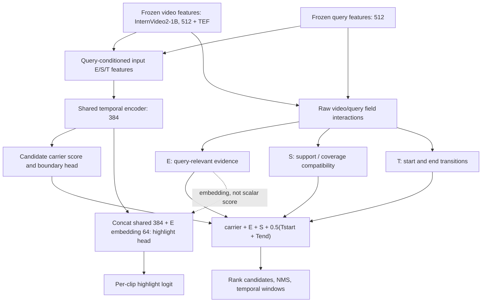

# C02: architecture and training equations

## Drawing the inference graph

The input conditioner and output field scorer are distinct parameterized modules. Do not draw the output E/S/T as exclusively consuming shared encoded H: the deployed output field interactions use the raw aligned 512-dimensional streams. Carrier remains in the final score; C02 is not the earlier pure-EST anchor proposal. Support also contains the inherited edge term and centered local residual with prediction-derived reference anchors. No GT is used to select these inference anchors. The scalar score is a ranking value, not a probability, and need not lie in [0,1]. HD is a separate branch, not part of the MR score.

## C02 evidence supervision (training only)

Let j be the reciprocal paired query for i. Compute the same learned E function twice: e(V_i,Q_i) and e(V_i,Q_j). Dropout is disabled only in these auxiliary E evaluations; normal forward dropout remains unchanged. No extra shared-backbone forward or new E parameters are introduced.

For each temporal GT interval g, weight clip t by its overlap length with g, normalized within g. Average GT intervals equally to obtain A_i = pool(e(V_i,Q_i), GT_i) and B_i = pool(e(V_i,Q_j), GT_i). C02 uses mean overlap pooling, NOT attention/softmax pooling. The four corners of a reciprocal pair are A_i, B_i, B_j, A_j.

For accepted queries:

    row_i = relu(0.2 - A_i + B_i)
    col_i = relu(0.2 - A_i + B_j)
    L_E = mean_i[0.5 * (row_i + col_i)]

Both directions are present because i and j are both included. Pairing requires different video IDs, different query IDs/text, and word-set Jaccard < 0.5. These are weak negatives, not guaranteed semantic negatives. Unmatched queries and missing GT pairs are excluded from the denominator. Empty batches return graph-connected zero. Valid GT overlap excludes padding and annotation-external tail tokens. Geometry is mapped from actual FPN coordinates to the original two-second annotation grid.

The two row and two column hinges can be algebraically equivalent to the row-only objective when all four constraints are active; do not claim that four corners always provide a different gradient. The column-only violation and excess-hinge probes diagnose actual differences.

## Total loss and routing

    L = 0.5 L_rank + 0.1 L_E + 0.1 L_S + 0.1 L_T
        + 0.1 L_endpoint + 0.1 L_HD

L_HD is omitted for task=mr. The unchanged ranking objective includes mixed-pool soft-IoU KL, quality calibration and candidate comparison. L_S uses truncated-coverage hinge and neutral expansion; L_T supervises transition geometry. Endpoint Gaussian supervision belongs to the parent boundary head, not the HD head. Rank derivatives to local support gate/readout, support projection and edge head are scaled by 0.1; auxiliary gradients are not scaled by that correction. These rules are inherited from F05; C02 changes E supervision only.

HD concatenates shared 384-dimensional clip features and the 64-dimensional E embedding, then LayerNorm, Linear(448,64), GELU, Linear(64,1). Its QV target is the fraction of the three annotators rating a clip 4. Balanced BCE includes the hardest 16 negative clips. E counterfactual supervision does not consume these ratings.

## Claims and limitations

All five development seeds are reported. Use the same validation-MR-best checkpoint for joint MR/HD results; HD-best is a separate selection. Fixed-weight deletion is not retraining ablation. Nonzero field gradients do not alone prove a positive effect. Test results have already been observed, and C02 was selected afterward. Feature/pretraining comparison adapters are separate unfinished work and are not represented as supported by this release.
