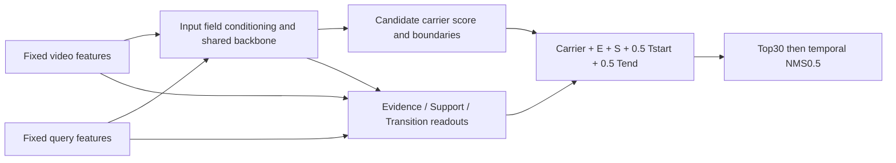

# Model and objective

The diagram summarizes the combined network; it does not assert every field independently passes through every shared encoder layer. Frozen feature extraction is not optimized. Final score is a ranking energy, not a calibrated probability constrained to [0,1]. This release retains carrier scoring; it is not the earlier pure-EST-anchor experiment.

The fixed V00 recipe retains calibrated ranking/quality objectives, endpoint supervision and all E/S/T auxiliary losses. The S objective uses a coverage-gap truncation hinge and neutral pure expansion. Rank-only gradients are scaled by0.1 for local support gate/readout, S projection and edge head parameters. Auxiliary gradients retain their original weights. This is gradient scaling, not conflict projection. See model_factory.py and coverage_loss.py for the executed replacement order. Diagnostic reference losses are not additional summed losses.

Batch64,24epochs, full-path joint optimization, strictFP32/noTF32, warmup3, LR milestones10/20/40, gamma0.3, no e11 parent decay. Seeds2041-2045. The legacy scratch_total_epochs constructor field is retained for reference initialization compatibility; the actual run budget is24, controlled by the runner phases/epochs. Runtime receipts check the optimizer and schedule.

E/S/T and structure probes are retained. Fixed-checkpoint deletion and retraining ablation answer different questions; this release supplies the former. See LIMITATIONS.md for claims not established by these experiments.
